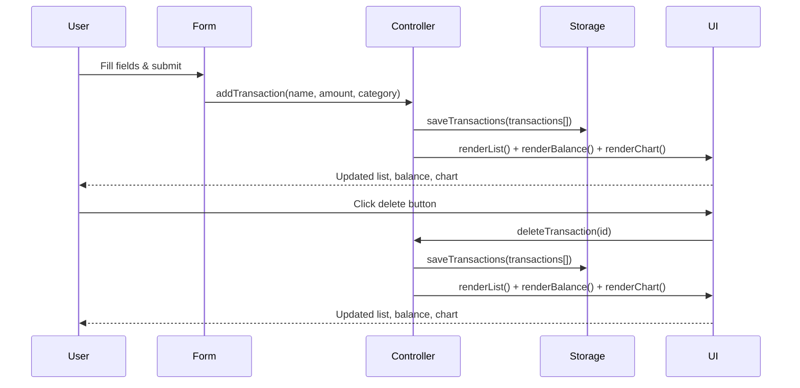
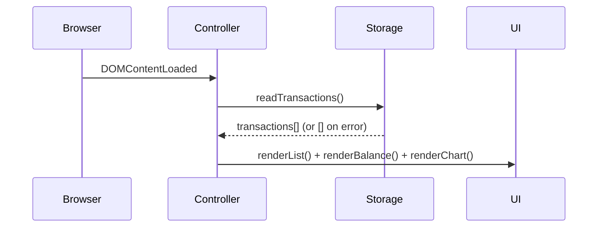

# Design Document: Expense & Budget Visualizer

## Overview

A single-page, client-side web application that lets users log expense transactions, view a running balance, browse a scrollable transaction list, and see a live pie chart of spending by category. No backend or build step is required — the app opens directly in a browser and persists all data in Local Storage.

**Technology stack:**
- HTML5 (single `index.html`)
- CSS3 (`css/styles.css`)
- Vanilla JavaScript ES6+ (`js/app.js`)
- Chart.js loaded via CDN (pie chart only)

**Target browsers:** Chrome, Firefox, Edge, Safari (current stable versions)

---

## Architecture

The app follows a simple MVC-like pattern within a single JS file, with three logical layers:

```
┌─────────────────────────────────────────────┐
│                   UI Layer                  │
│  Form · TransactionList · BalanceDisplay    │
│  Chart (Chart.js)                           │
└────────────────┬────────────────────────────┘
                 │ events / render calls
┌────────────────▼────────────────────────────┐
│               Controller Layer              │
│  addTransaction() · deleteTransaction()     │
│  loadFromStorage() · renderAll()            │
└────────────────┬────────────────────────────┘
                 │ read / write
┌────────────────▼────────────────────────────┐
│               Storage Layer                 │
│  saveTransactions() · readTransactions()    │
│  (wraps localStorage with error handling)   │
└─────────────────────────────────────────────┘
```

All state lives in a single in-memory array (`transactions[]`). Every mutation (add/delete) updates that array, persists it to Local Storage, then re-renders the UI.

### Data Flow



### Page Load Flow



---

## Components and Interfaces

### HTML Structure (`index.html`)

```
<body>
  <header>
    <h1>Expense & Budget Visualizer</h1>
    <div id="balance-display">Total: $0.00</div>
  </header>
  <main>
    <section id="form-section">   <!-- Form -->
    <section id="chart-section">  <!-- Chart.js canvas -->
    <section id="list-section">   <!-- Transaction list -->
  </main>
</body>
```

### Form Component

Inputs:
- `#item-name` — text, required
- `#amount` — number, min="0.01", step="any", required
- `#category` — select: Food | Transport | Fun, required
- `#submit-btn` — submit button
- `#form-error` — inline error container (hidden by default)

### Transaction List Component

- `<ul id="transaction-list">` — each `<li>` contains item name, amount, category badge, and a delete `<button data-id="...">`.
- Scrollable via CSS (`max-height` + `overflow-y: auto`).

### Balance Display Component

- `<span id="balance-amount">` — updated via `textContent` on every render.

### Chart Component

- `<canvas id="spending-chart">` — managed by a single Chart.js `Pie` instance.
- On each update, `chart.data` is mutated and `chart.update()` is called (no re-instantiation).
- Empty state: canvas shows Chart.js default empty-data placeholder.

### JavaScript Public Interface (`js/app.js`)

```js
// Storage layer
function readTransactions(): Transaction[]
function saveTransactions(transactions: Transaction[]): void

// Validator
function validateForm(name: string, amount: string, category: string): string | null
  // returns null if valid, or an error message string

// Controller
function addTransaction(name: string, amount: number, category: string): void
function deleteTransaction(id: string): void

// Render
function renderList(transactions: Transaction[]): void
function renderBalance(transactions: Transaction[]): void
function renderChart(transactions: Transaction[]): void
function renderAll(transactions: Transaction[]): void
```

---

## Data Models

### Transaction Object

```js
{
  id: string,        // crypto.randomUUID() or Date.now().toString() fallback
  name: string,      // item name, non-empty
  amount: number,    // positive float, stored as number
  category: string   // "Food" | "Transport" | "Fun"
}
```

### Local Storage Schema

- Key: `"expense_transactions"`
- Value: JSON-serialised `Transaction[]`

```js
// Write
localStorage.setItem("expense_transactions", JSON.stringify(transactions));

// Read
JSON.parse(localStorage.getItem("expense_transactions") ?? "[]");
```

### Category Colour Map

```js
const CATEGORY_COLORS = {
  Food:      "#FF6384",
  Transport: "#36A2EB",
  Fun:       "#FFCE56"
};
```

### Chart Data Shape (passed to Chart.js)

```js
{
  labels: ["Food", "Transport", "Fun"],   // only categories with amount > 0
  datasets: [{
    data: [number, number, number],        // summed amounts per category
    backgroundColor: [string, string, string]
  }]
}
```

---
