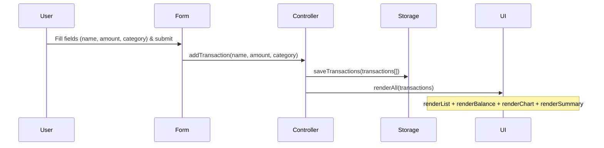

# Design Document: Expense Visualizer Enhancements

## Overview

This document describes the technical design for three enhancements to the existing Expense & Budget Visualizer:

1. **Custom Categories** — users define their own categories, each with a chosen colour.
2. **Monthly Summary View** — spending grouped and totalled by calendar month.
3. **Sort Transactions** — transaction list sortable by amount or category.

The app remains a single HTML file (`index.html`), one CSS file (`css/styles.css`), and one JS file (`js/app.js`) with no build step or backend.

**Existing stack (unchanged):**
- HTML5 / CSS3 / Vanilla JS ES6+
- Chart.js via CDN

---

## Architecture

The existing MVC-like layered architecture is extended with two new storage helpers and three new render functions. All state continues to live in in-memory arrays that are persisted to localStorage on every mutation.

```
┌──────────────────────────────────────────────────────────────┐
│                          UI Layer                            │
│  Form · CategoryManager · TransactionList · BalanceDisplay   │
│  Chart · MonthlySummary · SortControl                        │
└───────────────────────────┬──────────────────────────────────┘
                            │ events / render calls
┌───────────────────────────▼──────────────────────────────────┐
│                      Controller Layer                        │
│  addTransaction()  deleteTransaction()                       │
│  addCategory()     removeCategory()                          │
│  getSortedTransactions()  renderAll()                        │
└───────────────────────────┬──────────────────────────────────┘
                            │ read / write
┌───────────────────────────▼──────────────────────────────────┐
│                      Storage Layer                           │
│  readTransactions()   saveTransactions()                     │
│  readCategories()     saveCategories()                       │
└──────────────────────────────────────────────────────────────┘
```

### Data Flow — Add Custom Category

```mermaid
sequenceDiagram
    participant User
    participant CategoryManager
    participant Controller
    participant Storage
    participant UI

    User->>CategoryManager: Enter name + pick colour + click Add
    CategoryManager->>Controller: addCategory(name, color)
    Controller->>Storage: saveCategories(categories[])
    Controller->>UI: renderCategories() + update <select> options
```



### Data Flow — Add Transaction (updated)



### Page Load Flow (updated)

```mermaid
sequenceDiagram
    participant Browser
    participant Controller
    participant Storage
    participant UI

    Browser->>Controller: DOMContentLoaded
    Controller->>Storage: readTransactions()
    Storage-->>Controller: transactions[] (may lack date fields)
    Controller->>Controller: migrate — assign today's date to dateless transactions
    Controller->>Storage: saveTransactions(migrated[])
    Controller->>Storage: readCategories()
    Storage-->>Controller: categories[]
    Controller->>UI: renderAll(transactions) + renderCategories()
    Note over UI: populates <select> with built-ins + custom categories
```



---

## Components and Interfaces

### HTML Structure additions (`index.html`)

New sections are added inside `<main>` alongside the existing ones:

```html
<!-- Category Manager — new -->
<section id="category-section">
  <h2>Custom Categories</h2>
  <div id="category-form">
    <input type="text" id="category-name" placeholder="Category name" />
    <input type="color" id="category-color" value="#888888" />
    <button type="button" id="add-category-btn">Add</button>
  </div>
  <p id="category-error" role="alert" aria-live="polite"></p>
  <ul id="category-list"></ul>
</section>

<!-- Monthly Summary — new -->
<section id="summary-section">
  <h2>Monthly Summary</h2>
  <ul id="summary-list"></ul>
</section>

<!-- Sort Control — added inside existing list-section, above the <ul> -->
<label for="sort-control">Sort by</label>
<select id="sort-control">
  <option value="date-added">Date Added</option>
  <option value="amount-asc">Amount ↑</option>
  <option value="amount-desc">Amount ↓</option>
  <option value="category-az">Category A–Z</option>
  <option value="category-za">Category Z–A</option>
</select>
```

### Category Manager Component

- `#category-name` — text input for the new category name.
- `#category-color` — `<input type="color">` for the user to pick a colour (default `#888888`).
- `#add-category-btn` — button that triggers `addCategory()`.
- `#category-error` — inline error paragraph (hidden by default, shown on validation failure).
- `#category-list` — `<ul>` rendered by `renderCategories()`; each `<li>` shows the colour swatch, name, and a remove `<button data-name="...">`.

### Monthly Summary Component

- `#summary-section` — wrapping section.
- `#summary-list` — `<ul>` rendered by `renderSummary(transactions)`; each `<li>` shows `YYYY-MM` and the formatted total, listed in descending chronological order.

### Sort Control Component

- `#sort-control` — `<select>` with five options (see HTML above).
- Default value on load: `"date-added"`.
- Change event calls `renderList(getSortedTransactions(transactions, sortKey))`.

### JavaScript Public Interface (`js/app.js`) — full updated surface

```js
// ── Storage ──────────────────────────────────────────────────
function readTransactions(): Transaction[]
function saveTransactions(transactions: Transaction[]): void
function readCategories(): CustomCategory[]
function saveCategories(categories: CustomCategory[]): void

// ── Colour resolution ─────────────────────────────────────────
function getCategoryColor(category: string): string
// Checks CATEGORY_COLORS first (built-ins), then the custom categories array.
// Returns '#cccccc' as a fallback if the category is not found in either.

// ── Validation ───────────────────────────────────────────────
function validateForm(name, amount, category): string | null

// ── Controllers ──────────────────────────────────────────────
function addTransaction(name, amount, category): void
function deleteTransaction(id): void
function addCategory(name, color): void
function removeCategory(name): void

// ── Sort ─────────────────────────────────────────────────────
function getSortedTransactions(transactions, sortKey): Transaction[]
// sortKey: 'date-added' | 'amount-asc' | 'amount-desc' | 'category-az' | 'category-za'
// Returns a NEW array; never mutates the input.

// ── Render ───────────────────────────────────────────────────
function renderList(transactions): void
function renderBalance(transactions): void
function renderChart(transactions): void
function renderSummary(transactions): void
function renderCategories(): void
function renderAll(transactions): void
// renderAll calls renderList(getSortedTransactions(transactions, currentSortKey)),
// renderBalance, renderChart, renderSummary, and keeps renderCategories in sync.
```

---

## Data Models

### Transaction Object (updated)

```js
{
  id:       string,   // crypto.randomUUID() or Date.now().toString() fallback
  name:     string,   // item name, non-empty
  amount:   number,   // positive float
  category: string,   // built-in or custom category name
  date:     string    // ISO date string "YYYY-MM-DD", captured at add time
}
```

**Migration:** on `DOMContentLoaded`, any transaction where `date` is `undefined` or `null` is assigned `new Date().toISOString().slice(0, 10)` (today's date). The migrated array is immediately re-saved to localStorage.

### CustomCategory Object

```js
{
  name:  string,  // unique, non-empty, case-insensitive uniqueness enforced
  color: string   // CSS hex colour string, e.g. "#e74c3c"
}
```

### Local Storage Schema

| Key | Value |
|-----|-------|
| `"expense_transactions"` | JSON `Transaction[]` |
| `"expense_categories"` | JSON `CustomCategory[]` |

### Category Colour Resolution

```js
// Built-in colours — unchanged, hardcoded
const CATEGORY_COLORS = {
  Food:      '#FF6384',
  Transport: '#36A2EB',
  Fun:       '#FFCE56',
};

// Custom colours — looked up from the in-memory categories array
function getCategoryColor(category) {
  if (CATEGORY_COLORS[category]) return CATEGORY_COLORS[category];
  const custom = categories.find(
    c => c.name.toLowerCase() === category.toLowerCase()
  );
  return custom ? custom.color : '#cccccc';
}
```

`renderChart` uses `getCategoryColor(category)` for every label, replacing the previous direct `CATEGORY_COLORS[category]` lookup. This ensures custom categories appear with their chosen colour.

### Sort Keys

| `sortKey` value | Behaviour |
|-----------------|-----------|
| `"date-added"` | Original insertion order (index in array) |
| `"amount-asc"` | Ascending by `amount` |
| `"amount-desc"` | Descending by `amount` |
| `"category-az"` | Ascending alphabetical by `category` |
| `"category-za"` | Descending alphabetical by `category` |

`getSortedTransactions` returns a shallow copy (`[...transactions].sort(...)`) so the source array is never mutated.

---

## Correctness Properties

*A property is a characteristic or behavior that should hold true across all valid executions of a system — essentially, a formal statement about what the system should do. Properties serve as the bridge between human-readable specifications and machine-verifiable correctness guarantees.*

### Property 1: addCategory round-trip

*For any* valid category name and colour, after calling `addCategory(name, color)`, `readCategories()` should return an array that contains an entry with that exact name and colour, and the Form's `<select>` should include an option with that value.

**Validates: Requirements 1.2, 1.3, 1.4**

### Property 2: Duplicate category rejection

*For any* category name that already exists in the categories list (compared case-insensitively), calling `addCategory` with that name should leave the categories list unchanged and display an error.

**Validates: Requirements 1.6**

### Property 3: Category list renders with remove controls

*For any* non-empty list of custom categories, `renderCategories()` should produce one `<li>` per category, each containing a remove button whose `data-name` attribute matches the category name.

**Validates: Requirements 1.7**

### Property 4: removeCategory round-trip

*For any* custom category that has no associated transactions, after calling `removeCategory(name)`, `readCategories()` should not contain that name and the Form's `<select>` should not contain an option with that value.

**Validates: Requirements 1.8**

### Property 5: Remove blocked when transactions exist

*For any* custom category that has at least one transaction assigned to it, calling `removeCategory(name)` should leave the categories list and storage unchanged and display an error.

**Validates: Requirements 1.9**

### Property 6: Custom category colour persisted and resolved

*For any* custom category created with a specific colour, `getCategoryColor(name)` should return that exact colour string, and `renderChart` should use that colour for the corresponding dataset slice.

**Validates: Requirements 1.10, 4.4**

### Property 7: renderSummary groups by month with correct totals in descending order

*For any* non-empty array of transactions (each with a valid `date` field), `renderSummary` should produce exactly one summary entry per distinct `YYYY-MM` prefix, each entry's total should equal the sum of amounts for transactions in that month, and the entries should appear in descending chronological order.

**Validates: Requirements 2.1, 2.5, 2.7**

### Property 8: getSortedTransactions returns correctly ordered array

*For any* array of transactions and any valid `sortKey`, `getSortedTransactions(transactions, sortKey)` should return an array containing the same transactions in the order defined by that sort key (insertion order for `"date-added"`, numeric for amount keys, lexicographic for category keys).

**Validates: Requirements 3.2, 3.5**

### Property 9: getSortedTransactions does not mutate the source array

*For any* array of transactions and any sort key, calling `getSortedTransactions` should not change the order or contents of the original array passed in.

**Validates: Requirements 3.7**

### Property 10: Built-in categories cannot be removed

*For any* attempt to call `removeCategory` with a name matching a built-in category (Food, Transport, Fun), the categories list and storage should remain unchanged.

**Validates: Requirements 4.1**

### Property 11: renderBalance equals sum of all amounts

*For any* array of transactions (including those with custom categories), the value rendered in `#balance-amount` should equal the arithmetic sum of all `amount` fields, formatted to two decimal places.

**Validates: Requirements 4.5**

---

## Error Handling

| Scenario | Handling |
|----------|----------|
| `localStorage` unavailable or quota exceeded | `readTransactions` / `readCategories` return `[]`; `saveTransactions` / `saveCategories` log a `console.warn` and continue |
| Transaction missing `date` on load | Migration assigns today's date; re-saved immediately |
| `addCategory` with empty name | Show `#category-error` with "Category name cannot be empty." |
| `addCategory` with duplicate name | Show `#category-error` with "Category already exists." |
| `removeCategory` with assigned transactions | Show `#category-error` with "Cannot remove a category that has transactions." |
| `removeCategory` on built-in category | No-op (remove button not rendered for built-ins) |
| `getCategoryColor` for unknown category | Returns `'#cccccc'` fallback |
| Chart.js not loaded (CDN failure) | `renderChart` wraps instantiation in a try/catch; logs warning |

---

## Testing Strategy

### Dual Testing Approach

Both unit tests and property-based tests are required. They are complementary:
- **Unit tests** cover specific examples, integration points, and edge cases.
- **Property-based tests** verify universal correctness across many generated inputs.

### Property-Based Testing

**Library:** [fast-check](https://github.com/dubzzz/fast-check) (JavaScript, no build step needed via CDN or `<script type="module">` in a test HTML harness).

Each property test must run a **minimum of 100 iterations**.

Each test must include a comment tag in the format:
`// Feature: expense-visualizer-enhancements, Property N: <property text>`

| Property | Test description |
|----------|-----------------|
| P1 | Generate random `{name, color}` pairs; call `addCategory`; assert storage and `<select>` contain the entry |
| P2 | Generate a category; add it; generate case variants of the name; assert second add is rejected |
| P3 | Generate arrays of `CustomCategory`; call `renderCategories`; assert one `<li>` + remove button per entry |
| P4 | Generate a category with no transactions; add then remove; assert absent from storage and `<select>` |
| P5 | Generate a category + at least one transaction using it; attempt remove; assert list unchanged |
| P6 | Generate `{name, color}`; add category; assert `getCategoryColor(name) === color` |
| P7 | Generate arrays of transactions with random dates; call `renderSummary`; assert grouping, totals, and order |
| P8 | Generate transaction arrays; for each sort key assert the returned array is correctly ordered |
| P9 | Generate transaction arrays + sort key; assert source array is identical before and after call |
| P10 | For each built-in name call `removeCategory`; assert categories list unchanged |
| P11 | Generate transaction arrays with mixed categories; assert rendered balance equals `sum(amounts)` |

### Unit Tests

Focus on:
- **Migration edge case**: a transaction array with no `date` fields → after load, all have today's date.
- **Empty state**: `renderSummary([])` renders placeholder text.
- **Sort default**: on `DOMContentLoaded`, `#sort-control` value is `"date-added"`.
- **Form validation**: existing `validateForm` tests plus new category-selector population.
- **`getCategoryColor` fallback**: unknown category returns `'#cccccc'`.
- **Integration**: add a transaction with a custom category → chart slice appears with correct colour.
